# AMS - Agent-Based Stock Market Simulator

> *"While markets appear to work in practice, we are not sure how they work in theory."*
> -- Maureen O'Hara

**Development of an Agent-Based System for Stock Market Simulation**

*University of Milan - Bicocca, Faculty of Mathematical, Physical and Natural Sciences, B.Sc. in Computer Science*
*Author: Francesco Loprete -- Academic Year 2012/2013*

---

## Table of Contents

1. [Introduction](#1-introduction)
   - [Preliminary Notions](#11-preliminary-notions)
   - [System Considerations](#12-system-considerations)
   - [Hardware](#13-hardware)
2. [Tools Used](#2-tools-used)
3. [The System](#3-the-system)
   - [Classes](#31-classes)
   - [How It Works](#32-how-it-works)
4. [Strategies](#4-strategies)
5. [Final Remarks](#5-final-remarks)

---

## 1. Introduction

The goal of this project is to create an agent-based system for simulating a stock market. The aim is to study the collective behavior of agents that, by interacting on one or more stocks with different strategies and varying levels of knowledge, will attempt to maximize their own profit. Just as in a real stock market, the agents compete with each other, except in the case of market manipulation (*aggiotaggio*), where multiple agents cooperate to maximize profit. The system is inherently complex because its state is modified by the choices of each individual agent.

This chapter covers some of the economic topics addressed by this project along with their definitions, some considerations on the simplifications adopted compared to the real model, and finally a brief description of the hardware used for the simulations.

### 1.1 Preliminary Notions

#### 1.1.1 Stock Market

In finance, the stock market is the place, not necessarily physical, where stocks are traded. This market is divided into primary and secondary. On the primary market, newly issued shares are placed, while on the secondary market, already circulating stocks are traded. Issuing companies therefore raise new financial resources only through the primary market.

#### 1.1.2 Market Manipulation (Aggiotaggio)

Market manipulation is a crime regulated by the penal code (Article 501, titled "Fraudulent increase and decrease of prices on the public market or on stock exchanges"), which states:

> *"Anyone who, in order to disrupt the domestic market of securities or goods, publishes or otherwise disseminates false, exaggerated, or misleading news or employs other artifices capable of causing an increase or decrease in the price of goods, or of securities listed on the stock exchange or negotiable on the public market, shall be punished with imprisonment of up to three years and a fine from 516 to 25,822 euros. If the increase or decrease in the price of goods or securities occurs, the penalties are increased."*

The etymology of the Italian term *aggiotaggio* is usually traced back to the French word *agiotage*, derived from the Italian noun *aggio*, meaning "advantage, opportunity given or received for adjusting the value of one currency to that of another, or to exchange a worse currency for a better one."

#### 1.1.3 Insider Trading

The term insider trading refers to the buying and selling of securities (stocks, bonds, derivatives) of a specific company by individuals who, due to their position within the company or due to their professional activity, have come into possession of reserved, non-public information (referred to as privileged information). Such information, by its very nature, allows those who exploit it to gain an advantaged position compared to other investors in the same market. In this sense, it is also referred to as information asymmetry. Insider trading in the strict sense is therefore considered a crime.

### 1.2 System Considerations

Given the complexity of the real stock market model, some simplifications were necessary for building the system.

#### 1.2.1 Time Characteristics

Considering the real case of the Italian stock exchange, trading is divided into three phases:

- Opening auction
- Continuous trading
- Closing auction

The opening and closing auctions are ignored in the created model as they exhibit different behaviors compared to the better-known continuous trading phase. *Continuous trading* takes place from Monday to Friday, 9:00 AM to 5:25 PM. Assuming the stock price remains stable for 3 seconds to allow orders to be placed, we can assume the stock value is recalculated 10,100 times during this interval (8 hours and 25 minutes equals 30,300 seconds, divided by 3 seconds gives 10,100). To simulate a full day of iterations, one would need to set IPD (Iterations Per Day, see section 3.1) to 10,100. In the examples provided, the IPD value ranges between 100 and 500, as simulation times become very long otherwise.

#### 1.2.2 Numerical Representation

Within the created model, all variables dealing with the stock value are integers, on which only additions and subtractions are performed. The reason for this choice is the loss of precision that occurs with floating-point operations, and the criticality for an economic system of not losing money in transactions.

#### 1.2.3 Trades

In the real system, when a stock moves toward another value, all possible trades are executed for the starting price and for the prices encountered along the way. Note that the three-second rule does not apply here, and therefore due to timing issues it is possible that some orders encountered along the way are not executed. In the created system, only orders at the starting price and the arrival price are executed, since simulating this movement would have been complex and irrelevant to the purpose of the simulation.

### 1.3 Hardware

The system, implemented in Python, was tested on the following machine:

- Intel(R) Core(TM) i7-3520M CPU @ 2.90GHz
- 8 GB RAM
- 500 GB HD 5400rpm

Simulation times with a high number of agents (>200) and iterations (>400) require considerably long times (over 2 hours).

---

## 2. Tools Used

### 2.1 Python

Python was chosen as the programming language for the entire system, given its expressive power and flexibility. Python is a high-level, object-oriented programming language, suitable among other things for developing distributed applications, scripting, numerical computing, and system testing. It was created by Guido van Rossum in the late 1990s. Python is a multi-paradigm language that makes dynamism, simplicity, and flexibility its main objectives. It supports the object-oriented paradigm, structured programming, and many features of functional programming and reflection.

### 2.2 Matplotlib

Matplotlib is a library for drawing 2D graphics, producing quality figures in a variety of formats and interactive environments across multiple platforms. It can generate charts, histograms, power spectra, bar charts, error charts, scatter plots, and many others with just a few lines of code.

### 2.3 Alternative Tools

Several alternative tools are available for creating agent-based systems, such as NetLogo and Jade. For this project, it was decided not to use them because NetLogo is more suited to projects with a significant spatial component (it provides graphical tools to show the system's evolution), while Jade offers a high degree of parallelism but is more complex to use.

---

## 3. The System

### 3.1 Classes

The system is composed of a few key classes:

**Market** - Represents the stock market, whose task is to find the value for the stock at which the greatest number of trades occur, and subsequently execute all orders matching the found price based on their quantities. This aspect is fundamental as it is the core of the market.

**Titolo (Stock)** - Represents the stock, characterized by an identifier and a value.

**Ordine (Order)** - The Order class identifies the buy or sell order placed by Stock Brokers and sent to the Market. The system also allows short selling up to a maximum threshold.

**Event Generator** - This class randomly generates events that directly influence the stock value, simulating real-world cases where external events, such as company mergers or various issues, impact market trends.

**Test (main.py)** - The Test class is responsible for initializing the system through the data in a configuration file, executing the simulation, collecting data at each iteration on agent wealth and stock trends. At the end of the computation, data is displayed in graphical form for quick consultation.

Configuration file example:
```
Project SAE configuration file
*STOCK NAME*
ID=MPBS
PRICE=2345
INST=1
*MARKET*
ID=Banche Italiane
*AGENTS DETAILS*
TOP=10
BIG=25
RETAIL=120
*SCHEDULE*
DAYS=1
IPD=150
```

Where `INST` indicates the instability coefficient, i.e., how much the stock is influenced by external events. The value must be in a range between 0 and 100. The agent parameters are limited to the number of agents to create for each type. Regarding the schedule, the days and Iterations Per Day (IPD) to execute are specified.

**Agente (Agent)** - The Agent class outlines the Stock Broker figure, defined by some fundamental parameters:

- **id** - Unique identifier
- **Budget** - Available capital
- **gain** - Agent's profit/loss
- **investimento (investment)** - Amount currently invested
- **liquidita (liquidity)** - Total available liquidity

The strategies that are applied to operate on the stock are also implemented within this class. The class supports three types of agents based on budget:

| Type | Budget Range |
|------|-------------|
| Retail | 1,000 to 10,000 |
| Big | 20,000 to 400,000 |
| Top | 1,000,000 to 10,000,000 |

### 3.2 How It Works

Once started, the system reads the configuration file and initializes the stock, creates the required number of agents, assigns each a strategy, and sets the loop variables for the iterations. Strategy assignment can be arbitrary for studying particular configurations, or random.

After this initialization phase, the actual execution begins: agents are given the opportunity to either wait or apply a strategy. After each agent has had the chance to act, the market is updated by shifting the stock value according to the received orders. This repeats for the specified number of iterations. During execution, two additional support activities are performed: collecting statistics on the stock trend and agent capital, and the extraction of occasional events that influence the stock trend.

The output shown at each iteration by the Python program is simply the current iteration and the average capital of agents divided by type. At the end, summary graphs are displayed with the x-axis representing time (number of iterations) and the y-axis representing value.

Some tests were performed (in addition to those shown in Chapter 4) where all 160 agents created were assumed to apply a random strategy:

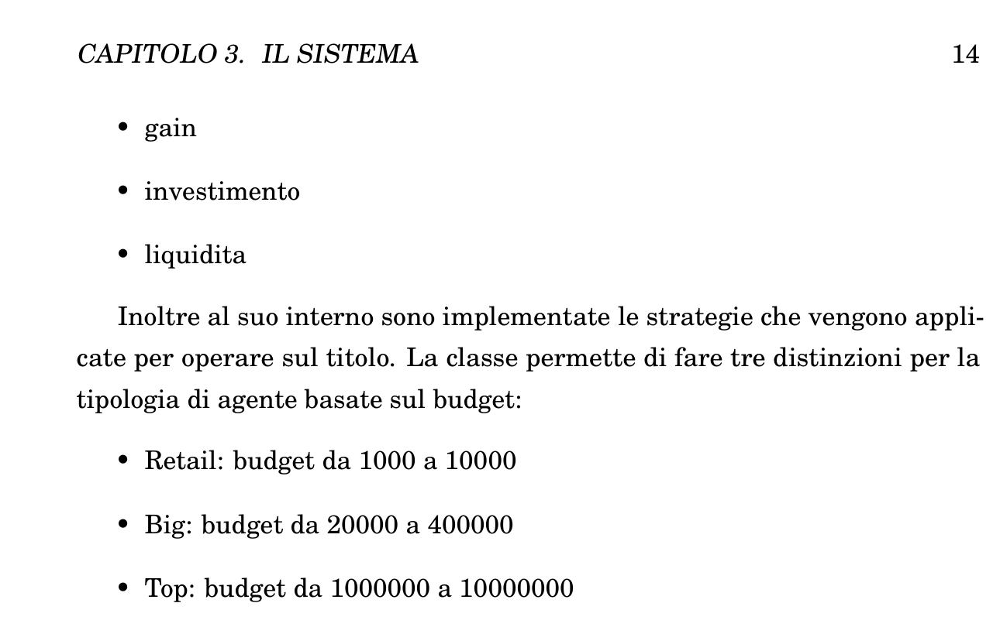
*Figure 3.1: First example of stock value variation.*

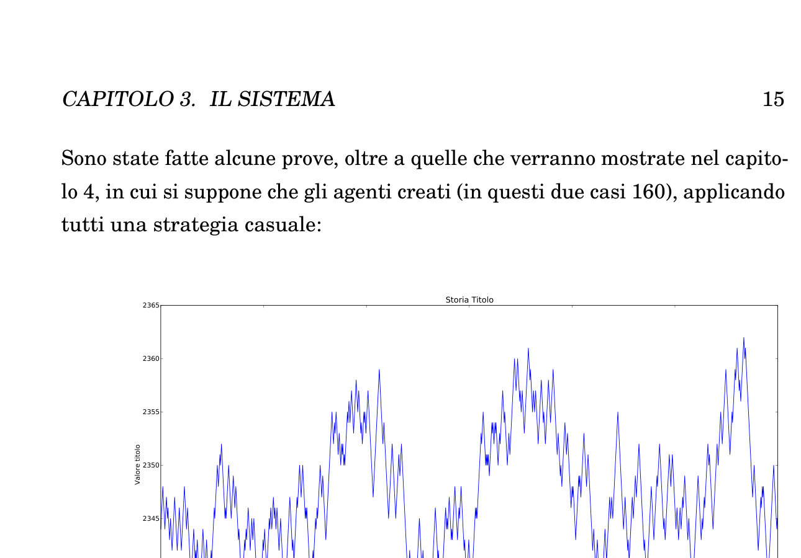
*Figure 3.2: Second example of stock value variation.*

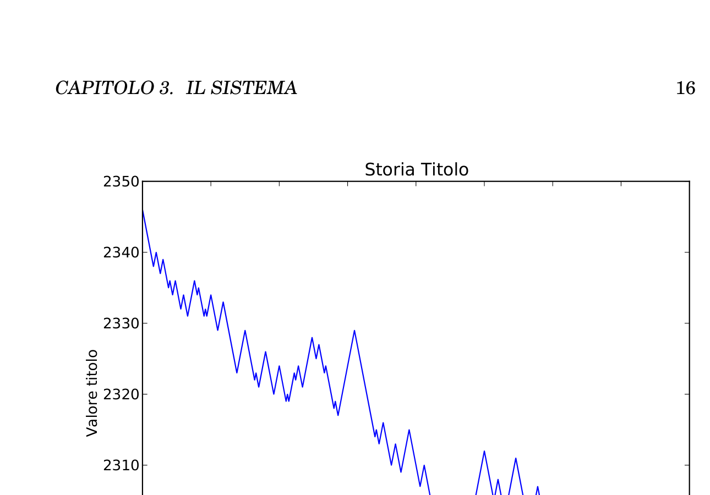
*Figure 3.3: Third example of stock value variation.*

---

## 4. Strategies

Let us now examine in detail the strategies implemented within the Agent class, as they represent the effective core of the system. It is important to note that no *fair* strategy can be successfully applied to all market situations; in fact, some of them are only winning under certain circumstances. *Unfair* strategies like insider trading and market manipulation tend to be favored in the majority of situations, as they leverage more information. However, under certain market conditions, such as moments with high trading volumes, even these strategies might not yield optimal results.

### 4.1 Strategy 01 - Random

This first strategy is naive, as it takes into account neither the state of the stock nor the Market, but only the budget available to the agent. It operates on the stock randomly. This strategy is intended for a small number of Retail agents, as it is plausible to think that agents in their early stages have not yet implemented more complex strategies. Figure 4.1 shows an execution example where all 155 agents present use this strategy. The data is not particularly indicative since no group of agents manages to make a profit over time, although the stock trend is comparable to real-world cases.

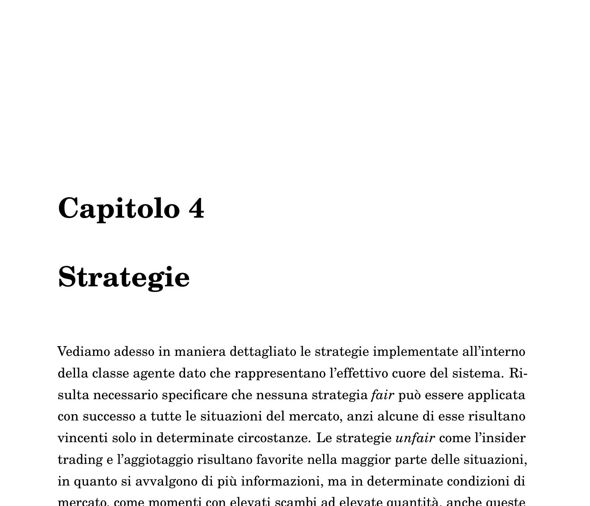
*Figure 4.1: Execution example with agents operating with Strategy 01.*

### 4.2 Strategy 02 - Trend Following

This strategy, before operating on the stock, creates a history of the stock's recent values, then tries to identify ascending or descending moments to attempt short-term gains. Applicable to Retail agents. From Figure 4.2, it can be seen how the strategy performs well during the initial iterations with a slight increase in the wealth of BIG agents (who implement this strategy). However, when the stock begins to oscillate rapidly, the strategy proves inadequate.

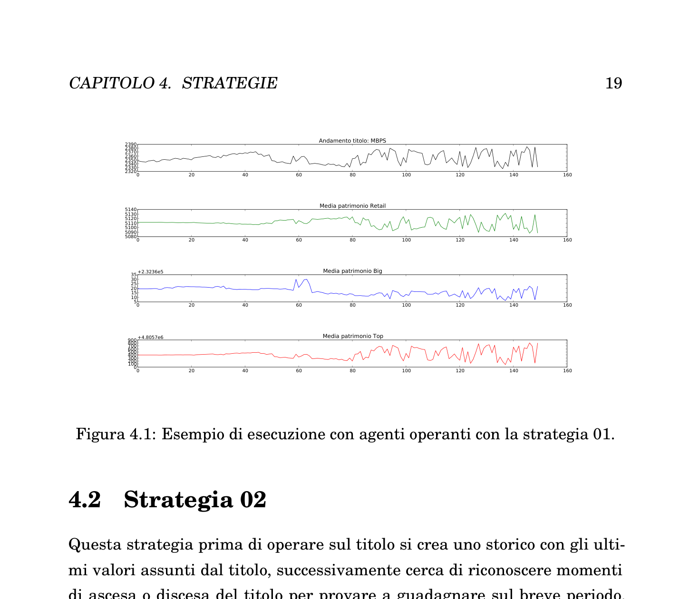
*Figure 4.2: Execution example with BIG agents operating with Strategy 02.*

### 4.3 Strategy 03 - Conservative

Strategy 03 is more conservative compared to the others and applies over short time frames, possibly during moments of strong stock oscillation. After a first order, it waits until the gain exceeds a certain threshold before placing another order to close the position. There is the possibility of having to hold the position for a long time due to unexpected stock variations in the opposite direction of the expectation. The possible gains tend to be low but with a higher degree of certainty compared to other strategies. The reported example (Figure 4.3) shows how, despite several oscillations, the value of the BIG agents' portfolio (operating with Strategy 03) remains slightly above the initial value for almost the entire simulation duration.

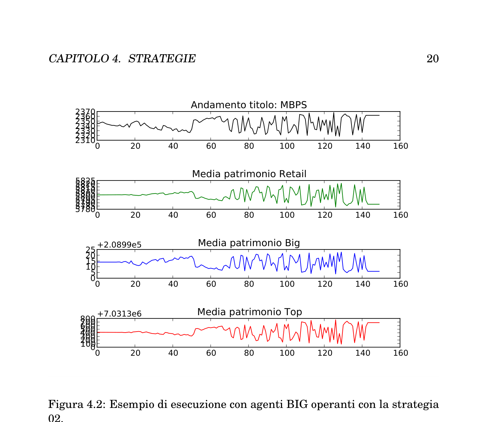
*Figure 4.3: Execution example with BIG agents operating with Strategy 03.*

### 4.4 Strategy 04 - Speculative (Top Agents)

The principle behind this strategy is that agents with larger capital can influence the stock's trend through large-volume orders. This strategy is intended for TOP agents. An example of this strategy (Figure 4.4) shows how it remains highly dependent on the stock's value: it certainly influences the value but does not manage to extract a *guaranteed* profit.

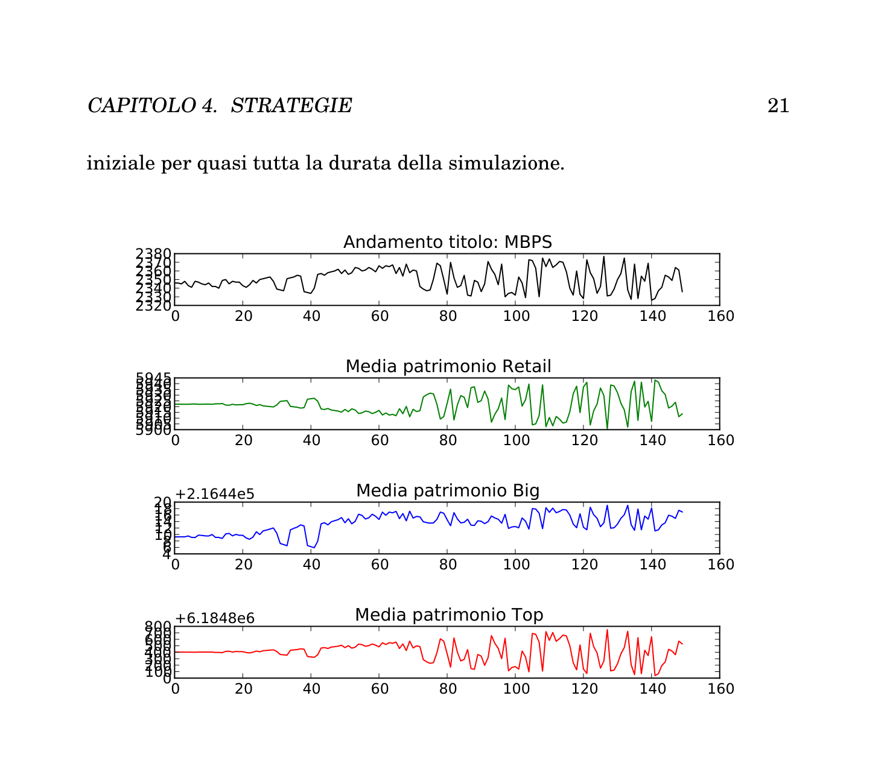
*Figure 4.4: Execution example with TOP agents operating with Strategy 04.*

### 4.5 Strategy 05 - Order Book Analysis

In this strategy, before placing any order, the orders placed by other agents are analyzed to try to predict the market's direction. Placed orders are visible to everyone, as in the real-world case. As shown in Figure 4.5, BIG agents tend to have a positive gain over the long term.

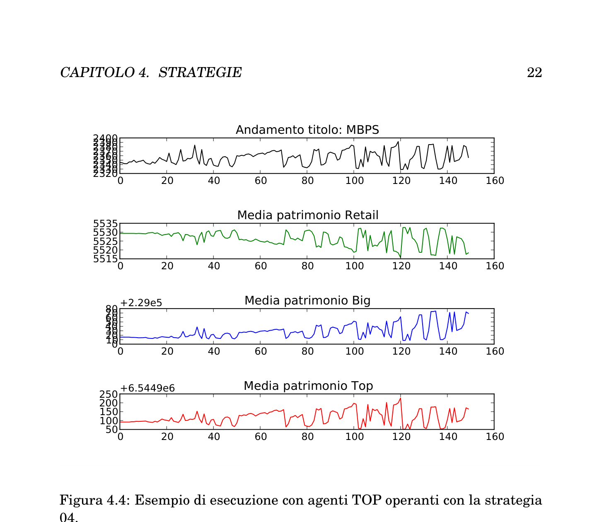
*Figure 4.5: Execution example with BIG agents operating with Strategy 05.*

### 4.6 Strategy 06 - Insider Trading

This strategy demonstrates an example of insider trading, executed by agents who have knowledge of external events that will affect the stock's value. As shown in the example (Figure 4.6), BIG agents implement Strategy 06 and manage to achieve a positive gain over the long term. The fluctuations in profit are due to the inability to close the position instantaneously, having to wait for the market to make this possible.

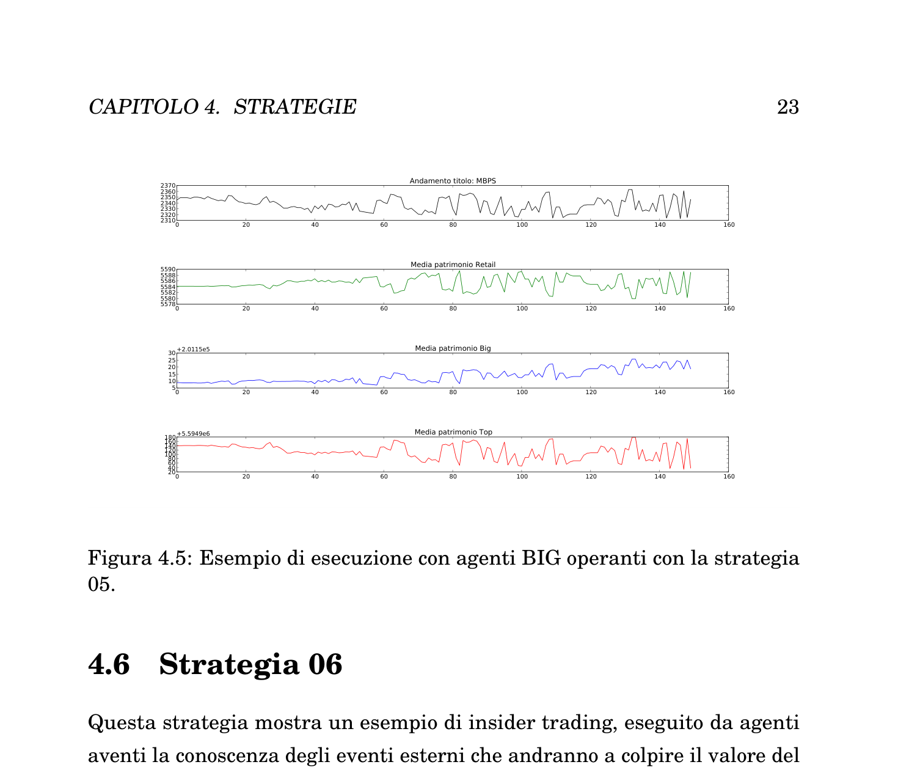
*Figure 4.6: Execution example with BIG agents operating with Strategy 06.*

### 4.7 Strategy 07 - Market Manipulation (Aggiotaggio)

The final strategy implements market manipulation. It is the most complex strategy, in which a group of agents coordinates to modify the stock price and extract a profit. Regarding synchronization, each agent declares to the others that they are part of the strategy and chooses a role. The possible roles are:

- **Investor**: their task is to place the first orders with large quantities
- **Follower**: they wait for the orders placed by investors and follow them, profiting from the movement

The two roles switch over time to allow everyone to profit through this mechanism. Synchronization occurs through a semaphore structure: each agent must complete their task before everyone can move to the next operation.

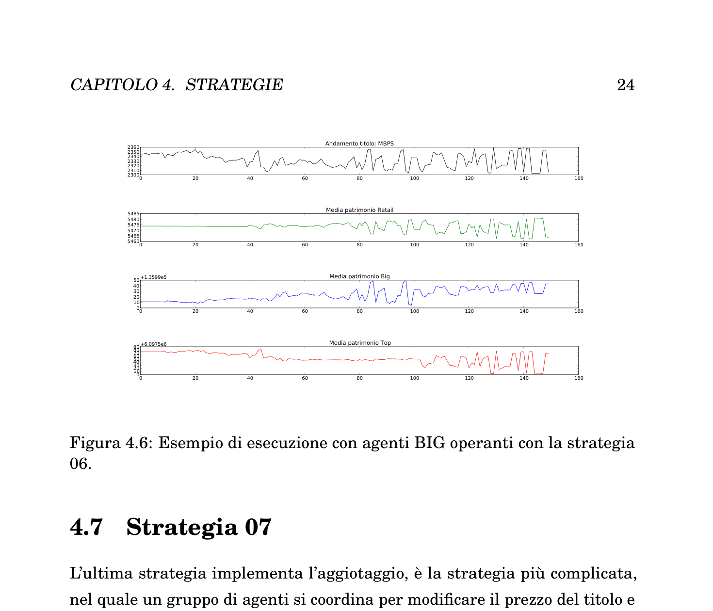
*Figure 4.7: Execution example with TOP and BIG agents operating with Strategy 07.*

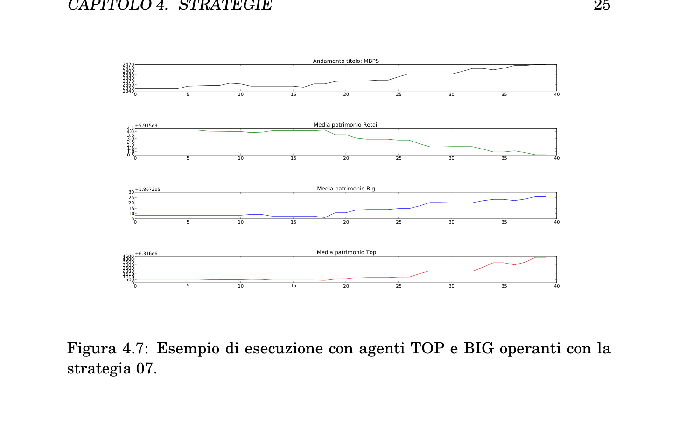
*Figure 4.8: Breakdown of agents performing market manipulation only.*

---

## 5. Final Remarks

### 5.1 Conclusions

The agent-based system successfully simulates the behavior of a stock in an acceptable manner, highlighting the behavior of agents based on their strategies. In an *honest* stock market, the involved agents should not communicate with each other. When this occurs, agents can cooperate to achieve their common objective: maximizing profit. Despite the ability to communicate, it is not guaranteed that agents will obtain greater profits, as the stock market system is complex and any operation on it modifies its state, which is a shared resource among all agents.

### 5.2 Future Developments

The system could be extended with the following features:

- More complex strategies integrating statistical prediction models (e.g., Markov Chains, Bayesian networks, etc.)
- Adding the ability to include multiple stocks whose trends are correlated
- Adding parameters for stock and agent behavior to recreate and study specific conditions

---

## Project Structure

```
Agent_Base_Market_Simulator/
├── README.md
├── LICENSE
├── config/
│   └── conf.txt              # Simulation configuration file
├── docs/
│   └── images/               # Figures from the report
│       ├── fig3_1_stock_value_example_1.png
│       ├── fig3_2_stock_value_example_2.png
│       ├── fig3_3_stock_value_example_3.png
│       ├── fig4_1_strategy_01.png
│       ├── fig4_2_strategy_02.png
│       ├── fig4_3_strategy_03.png
│       ├── fig4_4_strategy_04.png
│       ├── fig4_5_strategy_05.png
│       ├── fig4_6_strategy_06.png
│       ├── fig4_7_strategy_07.png
│       └── fig4_8_manipulation_agents.png
└── src/
    ├── main.py                # Entry point - simulation runner
    ├── Agente.py              # Agent class with all strategies
    ├── Market.py              # Market class - order matching engine
    ├── Ordine.py              # Order class
    ├── Titolo.py              # Stock class
    └── Event_generator.py     # Random event generator
```

## Usage

```bash
cd src
python main.py
```

Make sure you have `matplotlib` installed:
```bash
pip install matplotlib
```

## References

1. Economic definitions of: Stock Market, Market Manipulation, Insider Trading. http://it.wikipedia.org/
2. Italian stock exchange trading hours. http://www.borsaitaliana.it/
